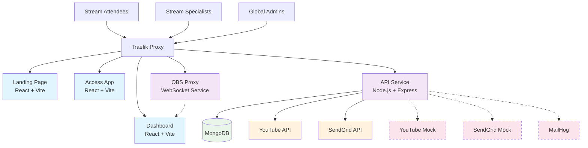

# LDSChurch.Stream

A tool to help congregations of The Church of Jesus Christ of Latter-Day Saints provide YouTube streams of their sacrament meetings.

## Quick Start

### Development Setup

1. **Prerequisites**
   - Docker and Docker Compose
   - Node.js 18+ (for local development)

2. **Start Development Environment**

   ```bash
   docker compose up --watch
   ```

3. **Access Applications**
   - Landing Page: http://ldschurch.traefik.me
   - Stream Dashboard: http://dashboard.traefik.me
   - API Documentation: http://api.traefik.me/api/docs
   - Database Admin: http://db.traefik.me
   - Email Testing: http://mail.traefik.me
   - OBS Proxy: http://obs-proxy.traefik.me
   - Stream Access: http://blacksburg-va.traefik.me (example)

### Production Deployment

Deploy to Kubernetes cluster:

```bash
kubectl apply -f k8s/
```

## Architecture

- **API**: Node.js/Express backend with MongoDB
- **Dashboard**: React app for stream specialists
- **Access**: React app for stream attendees (subdomain-based)
- **Landing**: Marketing/info site



## Key Features

- YouTube Live stream management
- Remote OBS control via WebSocket proxy
- Automated attendance reporting
- Subdomain-based unit access
- Weekly email reports to leadership
- Automated stream cleanup (24-hour retention)

## Church Guidelines Compliance

- Stream recordings deleted within 24 hours
- Unlisted YouTube events for privacy
- Honesty-based attendance (no identity verification)

---

**Note**: This is not an official product of The Church of Jesus Christ of Latter-Day Saints.
